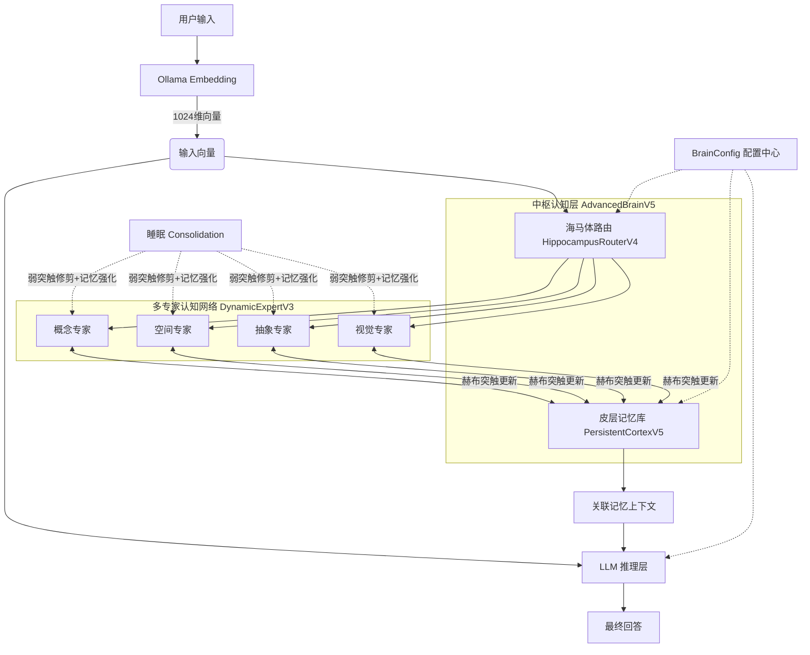
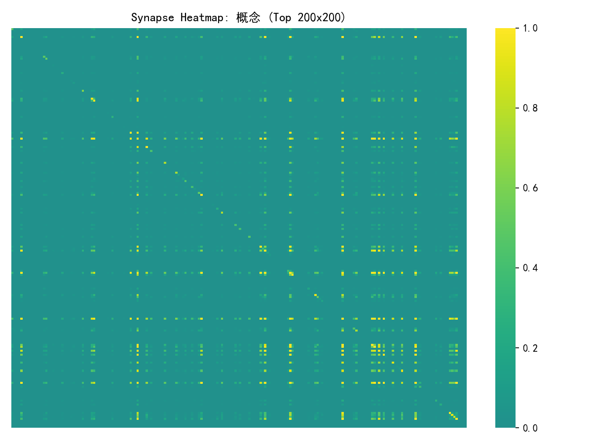
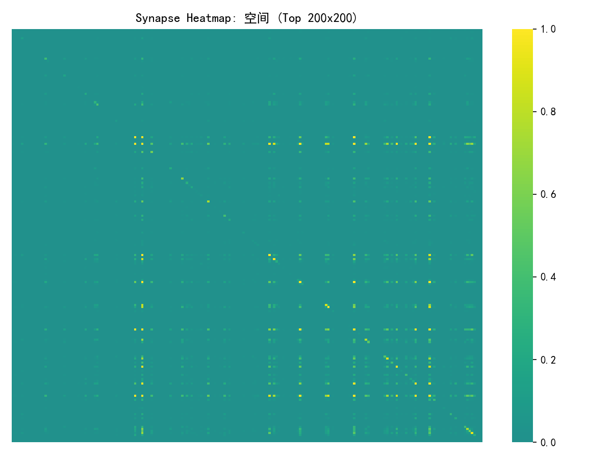
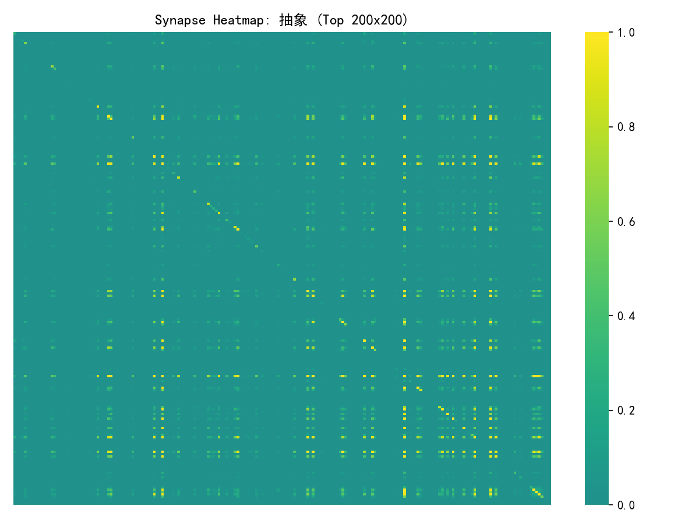

# Brain-Inspired LLM Long-Term Memory System
## 类脑启发式大模型长期记忆系统

> 浙大城市学院｜研究生个人兴趣探索项目
> 原创架构设计，AI 辅助工程实现，仅用于学习与科研实验

---

## 📌 项目介绍
本项目为**四天课余独立探索作品**，完全由本人原创顶层架构与设计思路，
借鉴人脑海马体-皮层认知分工逻辑，搭建一套**仿生类脑长期记忆实验系统**。

### 项目真实定位
1. 整套认知架构、模块划分、仿生机制、功能设计**完全原创构思**
2. 工程代码、底层工具实现由大模型辅助编写
3. 本人全程负责方案设计、逻辑把控、bug 调试、迭代优化、效果验收
4. 纯个人兴趣驱动，非导师课题、非任务作业，偏向类脑 AI 认知方向入门实验

---

## ✨ 核心设计亮点
区别于传统简单 RAG 向量检索，本项目完全走**生物启发式认知路线**：

- 🧠 **海马体智能路由**
  自动理解用户问题语义，分类分发至对应认知专家，解决知识混杂、检索混乱问题

- 🧩 **多专家皮层分区**
  模拟大脑功能分区，划分四大独立认知模块：
  - 概念专家：人物、实体、身份、专有名词
  - 空间专家：历史事件、时间、地点、时序内容
  - 抽象专家：理论、名言、定义、通识知识
  - 视觉专家：预留视觉认知扩展接口

- ⚡ **赫布联想突触学习**
  遵循「共同激活、连接强化」规则，高频关联记忆自动加深绑定，实现越用越牢

- 🧬 **稀疏神经编码机制**
  模拟人脑稀疏激活特性，降低冗余存储，提升记忆抗干扰能力

- 🌙 **睡眠记忆巩固**
  复刻人脑夜间修复逻辑：自动修剪无效弱突触、强化核心记忆、梳理知识结构

- 🔄 **分层记忆生命周期**
  短期记忆→长期记忆→永久记忆分级标记，搭配自然遗忘衰减，高度仿生

---

## 📊 系统运行现状
本地全离线部署（Ollama + BGE-M3 1024维向量），已完整闭环稳定运行：
- 总记忆条数：**2654 条**
- 专家分布：抽象 1149｜概念 906｜空间 599｜视觉 0
- 全局突触稀疏度：稳定维持 **94%+**
- 支持：语义去重合并、自动索引重建、睡眠修剪、永久记忆标记
- 完整日志输出、脑状态检测、突触热力图可视化、全数据持久化

---

## 🧠 系统架构

## 🧬 突触权重演化可视化
依托仿生赫布学习机制，记忆在持续交互中动态强化关联；
同时通过睡眠巩固完成弱连接修剪，模拟人脑记忆代谢规律。

每组专家包含四张时序热力图：
- `1 / 2 / 3`：日常交互学习的完整时间演化流程
- `sleep`：睡眠修剪完成后的最终稳态突触分布

### 概念专家｜人物·实体记忆演化
#### 1

#### 2

#### 3

#### sleep

### 空间专家｜事件·时序记忆演化
#### 1

#### 2

#### 3

#### sleep

### 抽象专家｜理论·概念记忆演化
#### 1

#### 2

#### 3

#### sleep

> 视觉说明：
> 暖色调 = 高权重强关联突触（高频记忆持续强化）
> 冷色调 = 低权重弱连接
> 睡眠阶段会批量修剪无效冗余突触，大幅提升整体稀疏度与运行效率
